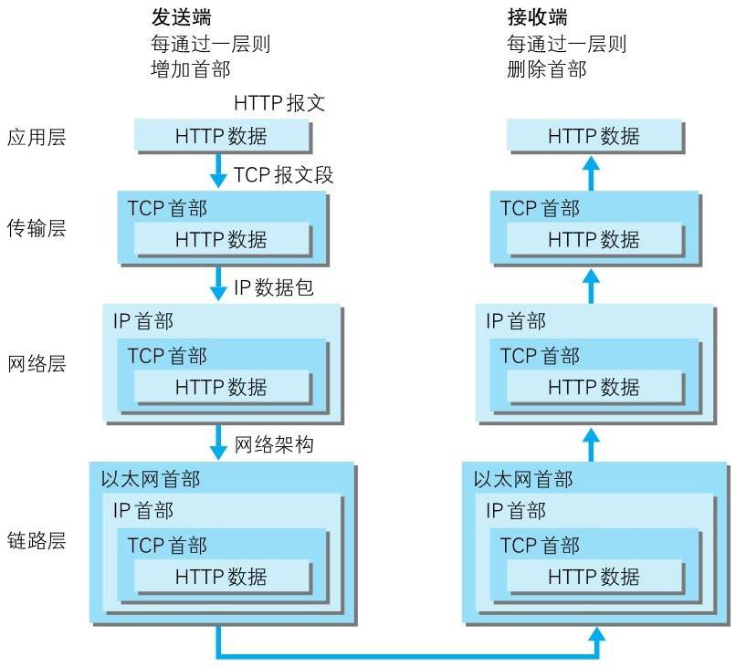
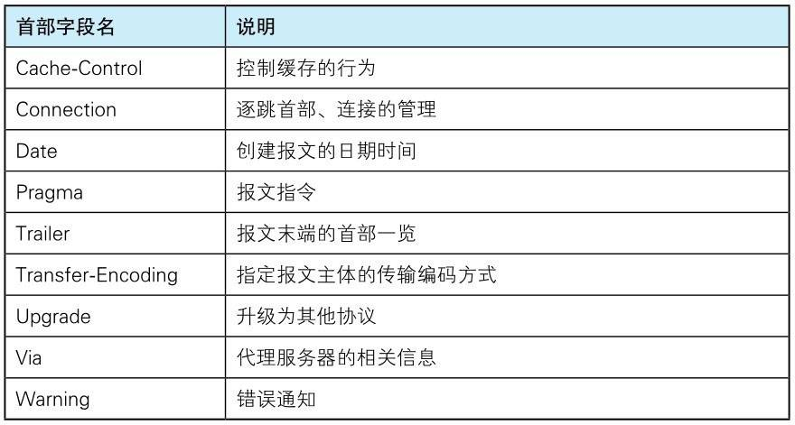
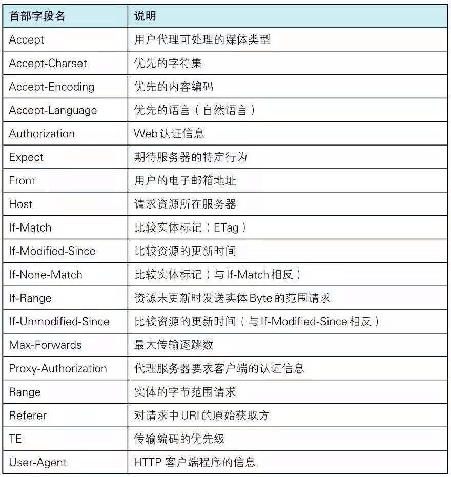
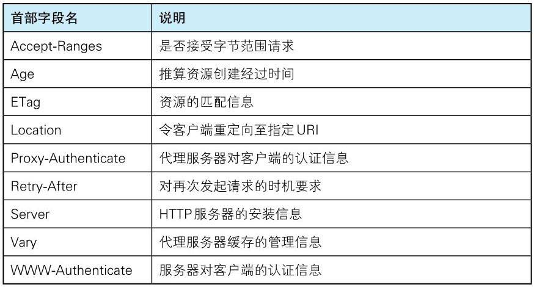
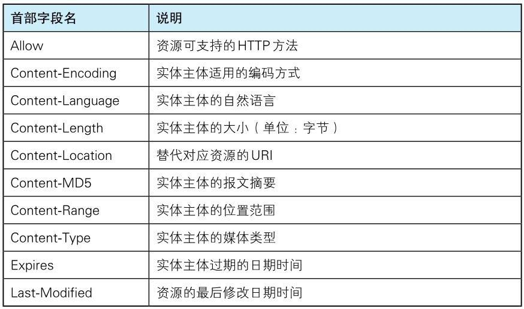

# http-analysis
http知识梳理
## web构建技术
**html**：页面文本标记语言  
**http**：文档传输协议  
**URL**：统一资源定位符  
## TCP/IP四层结构
### 应用层
决定向用户提供服务时通信的活动。  
包含：  
**FTP**：文件传输协议。  
**DNS**：域名系统。  
等，HTTP也属于此层。
#### DNS
负责通过域名查找IP地址或通过IP地址反向查找域名的服务。
### 传输层
提供网络连接中计算机之间的通信。  
**TCP**：传输控制协议。  
**UDP**：用户数据报协议。 
#### TCP协议  
TCP协议主要提供字节流服务，将大块数据分割成以报文段为单位的数据包，并能够将所传输的信息准确的合成完整的信息给接收方。TCP链接使客户端和服务器之间的报文交换不会丢失、破坏和错序。    
TCP三次握手：发送方发送一个带有SYN标志的数据包给对方，接收方收到后回传一个带有SYN/ACK标志的数据包给发送方，告知发送方收到数据，最后发送方再发送一个带ACK标志的数据包给接收方，告知“握手结束”。
### 网络层  
用来处理网络上流动的数据包，规定通过何种传输线路向目标传送数据包。（数据包为网络传输最小数据单位）  
**IP**：网际协议。  
#### IP协议 
IP协议保证正确传输的两个条件。  
**IP地址**：指明节点被分配的地址。  
**MAC地址**：指网卡所属的固定地址。   
IP地址可以和MAC地址进行配对，IP地址可变换，MAC地址基本上不会更改。IP间的通信依赖MAC地址。  
通常通信需要经过多个计算机或网络设备的中转才能进行连接，中转时会利用下一站中转设备的MAC地址搜索目标。  
而通过ARP协议，利用接收方的IP地址，就可以反向查到接收方的MAC地址。  
### 数据链路层  
用来处理连接网络的硬件部分。 
## 数据传输流程
没通过一层结构会被打上该层所属首部信息，这种数据包装起来的做法被称作封装。  



### URL、URI和URN
**URL**：统一资源定位符，web网页地址，通过资源位置标识资源。  
**URN**：统一资源名，通过资源名称标识资源。  
**URI**：统一资源标识符，URI用字符串标识某一资源，URL则标识资源的位置，URI包含URL、URN。   
## HTTP协议
无状态协议，自身不对请求和响应之间的通信状态进行保存。
### 作用：
使用URI定位互联网资源，实现客户端与服务端的通信。也可以通过‘*’来代替请求URI，实现对服务器本身的请求。
```
OPTIONS * HTTP/1.1
```
### HTTP请求方法
**•GET**：请求访问已被URI识别的资源。   
**•POST**：安全传输主体实体。   
**•PUT**：传输文件，但由于自身不带验证机制，任何人都可上传，存在安全性问题。  
**•HEAD**：获取报文首部，用于确认URI有效性以及资源更新日期时间等。   
**•DELETE**：删除文件，但由于自身不带验证机制，存在安全性问题。  
**•OPTIONS**：查询针对请求URI指定的资源支持的方法。   
**•TRACE**：追踪路径，客户端通过TRACE方法可以查询发送出的请求是怎样被加工修改,服务器响应主体中会包含服务器收到的请求的精确副本。请求想要连接到服务器会通过代理中转，TRACE方法可以确认连接过程中发生的操作。     
**•CONNECT**：要求代理服务器通信时建立隧道，使用SSL和TLS协议把通信内容加密后经网络隧道传输。   
### keep-alive（HTTP长连接）
无长连接时每次请求都会造成无谓的TCP连接建立和断开，增加通信开销。使用长连接后只要一端没有提出断开连接，则保持TCP连接状态。而且长连接使多个请求可以管线式发送，不用等待响应，便可并行发送请求。 
### Cookie（HTTP状态保存）
使用Cookie会根据服务端响应报文中的Set-Cookie首部字段，通知客户端保存Cookie。当客户端再次发送请求时，客户端会自动在请求报文中添加Cookie值发送出去。
#### 作用：
主要实现用户识别he状态管理。
#### Set-Cookie
```
Set-Cookie: Name=Value;expires=date;path=/;domain=baid.com;secure;HttpOnly
```
**Name=Value**：cookie名值对。  
**expirse**：cookie有效期，省略则为浏览器应用程序关闭前，cookie从服务器发至客户端后，则不可显式删除，只可覆盖。  
**path**：指定可发送cookie的文件目录。  
**domain**：指定可发送cookie的域名。  
**secure**：限制cookie只能在https下发送，省略则无限制。  
**HttpOnly**：限制JavaScript获取操作cookie。  
### HTTP编码
通过传输编码，能提升HTTP传输速率。
#### 内容编码
应用于实体内容的编码格式，使实体信息原样压缩。编码后的实体由客户端接收并负责解码。  
常见内容编码：gzip、compress、deflate、identity。
#### 分割传输编码
传送大数据时，将实体主体分成多个块进行传输，让浏览器逐步显示页面。
### 多部分对象集合
HTTP发送的一份报文主体内可含有多类型实体，通常用于图片，文件等的上传，需要在首部加入Content-Type字段，使用boundary来进行各部分的划分。  
#### 包含对象
**•multipart/form-data**    
Web表单文件上传时使用。 
```
Content-Type : mutipart/form-data;boundary = AaB03x
-- AaB03x
Content-Disposition : form-data;name = "fieldl" 
Joe Blow
--AaB03x
Content-Disposition : form-data; name = "pics"; filename = "file1.txt"
Content-Type : text/plain
//(file1.txt的数据) 
--AaB03x
```
**•multipart/byteranges**    
206，响应报文包含多个范围内容。
```
Content-Type multipart/byteranges; boundary = THIS_STRIMG_SEPARATES
--THIS_STRING_SEPARATES
Content-Type : application/pdf
Content-Range:bytes 500-999/8000
//范围指定的数据
--THIS_STRING_SEPARATES
Content-Type : application/pdf
Content-Ranges : bytes 7000-7999/8000
//范围指定的数据
--THIS_STRING_SEPARATES
```
### 范围请求
发送指定数据范围的请求，可以针对大文件的传输中断进行重新恢复。首部加入range字段，规定请求的byte范围，服务器响应206.如果服务器无法响应范围请求则返回200和完整数据内容。
### 内容协商
针对不同的客户端特性返回不同的资源。（主要关联到的首部字段Accept、Accept-Charset、Accept-Encoding、Accept-Language、Content-Language）  
内容协商主要由三种类型，由服务器驱动协商，由客户端驱动协商，以及服务器与客户端配合jinxing驱动。
### 状态码
#### 1xx
信息性状态码，请求正在处理。
#### 2xx
成功状态码，请求正常处理完毕。常见有200请求成功、204响应不包含实体、206范围请求成功。
#### 3xx
重定向状态码，需要进行其他操作以完成请求。常见有301永久重定向、302（HTTP1.0客户端使用302，HTTP1.1客户端使用307）临时重定向（下次请求时仍为原地址）、303将POST改为GET方法定向获取请求的资源,304服务端资源未修改请使用缓存。（301、302、303状态时，浏览器会自动将请求方法转换为GET，并自动发送。）
#### 4xx
客户端错误状态码，服务器无法处理请求。常见有400请求包含语法错误、401请求需要有HTTP认证信息，403拒绝访问资源、404无法找到请求资源、405请求方法不支持、406没有与请求资源类型相匹配的资源。
#### 5xx
服务端错误状态码，服务器处理请求出错。500服务端执行请求时发生错误、502中间代理网关出错、501客户端请求超出服务器处理范围（如请求方法不支持）、503服务器超负载或停机无法处理请求、504网关请求超时、505无法支持的协议版本。
### 代理
在客户端和服务端之间过滤和转发请求，且每次转发都在首部添加via字段，标识经过的主机。
#### 缓存代理
缓存代理可以预缓存资源，客户端再次请求时，无需再访问服务器。
#### 透明代理
转发和请求时不对请求做任何处理。
### 网关
使通信线路上的服务器提供非HTTP协议服务，并可以对客户端与网关通信线路加密，以确保连接安全。
### 隧道
建立客户端与服务器的通信线路，并可以使用SSL等手段进行加密，确保通信安全。
### 缓存
缓存可以优化请求，且具有有效期。
#### 服务器缓存
利用缓存代理服务器可以避免多次从服务器转发资源。
#### 客户端缓存
存储与客户端的临时网络文件。
### 首部字段
#### 通用首部字段
  

**Canche-control**：控制缓存行为。  
请求缓存指令：  
no-cache：客户端强制缓存服务器向源服务器再次验证，防止信息过期。  
no-store：不缓存本地或缓存服务器响应的任何内容，每次都需要向服务器确认。。  
max-age=1s（必须）：资源缓存最大有效期，缓存服务器如果判定缓存资源有效时间比max-age时间更小，客户端则接受缓存资源。  
max-stale=1s：客户端接收已过期响应，有值则表示过期时间在max-stale指定时间内，仍然可被接受。  
max-fresh=1s（必须）：客户端可以接受响应时间小于当前时间加上指定时间的响应。  
no-transform：代理不可更改媒体类型，防止页面转码以及代理压缩图片。    
only-if-cached：从缓存服务器获取资源，不再确认有效性，无响应，则返回504。  
cache-extension：新指令标记。
响应缓存指令：
public：缓存服务器可以向任意方提供响应的缓存。  
private：缓存服务器仅向特定用户返回响应的缓存。  
no-cache：源服务器禁止缓存服务器缓存资源，若存在参数值，则客户端接收到指定参数字段对应的响应报文后，不能使用缓存，否则可以使用本地缓存。  
no-store：不缓存本地或缓存服务器响应的任何内容，每次都需要向服务器确认。  
no-transform：代理不可更改媒体类型，防止页面转码以及代理压缩图片。  
must-revalidate：作用类似no-cache，会忽略请求的max-stale指令。  
proxy-revalidate：要求缓存服务器对缓存的有效性再进行确认。  
max-age=1s（必须）：响应中存在max-age，缓存服务器不对资源有效性再进行确认，数值代表资源保存为缓存的最长时间，优先级高于EXpirse。  
s-maxage=1s（必须）：功能同max-age，但适用于公共缓存服务器优先级高于max-age与Expires。  
cache-extension：新指令标记。 
**Connection**：控制不再转发给代理的首部字段，管理持久连接，HTTP/1.1版本默认连接是持久连接，HTTP/1.1以前则需要指定Connection: keep-alive。    
**Date**：标明创建HTTP报文的日期时间。  
**Pragma**：遗留字段，兼容HTTP/1.1之前版本，值为no-cache，只用于客户端请求中，要求中间服务器不返回缓存资源。  
**Trailer**：记录报文主体记录了哪些首部字段，应用于分块传输编码时。  
**Transfer-Encoding**：规定了传输报文主体时采用的编码方式。  
**Upgrade**：检测协议是否可使用更高版本，参数值可指定不同通信协议，需要额外指定Connection参数为Upgrade，且只作用于客户端与邻近服务器之间。  
**Via**：追踪客户端与源服务器之间的请求和响应报文的传输路径。  
**Warning**：告知用户一些相关问题。  
#### 请求首部字段
   

**Accept**：告知服务器用户代理可处理的媒体类型，以及媒体类型优先级。  
```
Accept: text/html,application/xhtml+xml,application/xml;q=0.9;q=0.8;q=0.7
```
服务器优先返回优先级高的类型资源。  
****Accept-Charset****：通知服务器用户代理支持的字符集及字符集的优先级q。  
****Accept-Encoding****：通知服务器用户代理支持的内容编码以及优先级q。  
****Accept-Language****：通知服务器用户代理可处理的自然语言及优先级q。  
****Authorization****：告知服务器用户代理认证信息。  
****If-Match****：值与资源Etag一致时，服务器才会执行请求，某则返回412。  
****If-Modified-Since****：用于确认代理或客户端资源有效性，若值之后的时间资源修改过，则服务器处理该请求，某则返回304使用缓存资源。  
****If-None-Match****：与If-Match相反，通过此字段可获取服务器最新资源。  
****If-Range****：通知服务器若值与资源Etag或更新时间相一致，则返回指定范围资源，否则返回全部资源。  
**Max-Forwards**：主要设置TRACE和OPTIONS方法使经过的最大服务器数目。   
**TE**：定义传输编码的方式和优先级q。  
#### 响应首部字段
  
**Accept-Ranges**：告知客户端是否能处理范围请求，可处理返回bytes，否则返回none。  
**ETag**：告知客户端资源标识。强ETag，资源发生任何变化，都会改变值。弱Etag，资源发生根本变化，才改变值，并在值前面加W/。  
**Retry-After**：通知客户端多久后再次发送请求。主要配合503和3xx使用。  
**Vary**：代理服务器收到源服务器Vary字段，Vary字段所含首部字段与请求相匹配时，代理才返回缓存，否则向源服务器获取最新资源。  
#### 实体首部字段
  

**Allow**：服务器通知客户端所支持的请求方法。  
**Content-Length**：实体主体大小，内容编码时不能使用此字段。  
### 请求报文
由请求方法、请求URI、协议版本、可选的请求报文首部字段和请求报文实体。
```
/*
 GET：请求服务器的方法
 /index.html：访问资源，请求URI
 HTTP/1.1：HTTP版本号
 */ 
GET /index.html HTTP/1.1
```
### 响应报文
由版本协议、状态码、状态码的原因短语、响应报文首部以及响应主体构成。
```
/*
 HTTP/1. 
 200：状态码
 OK：状态码原因短语
 */
HTTP/1.1 200 OK
```
### HTTPS
HTTP的不足：  
**•**未加密，内容可能被窃听。    
**•**客户端和服务器不能验证通信方身份，可能遭遇伪装。    
**•**无法验证报文完整性，报文可能被篡改。    
HTTPS概念：HTTP与SSL组合使用，由HTTP与SSL通信，再由SSL与TCl进行通信拥有加密和认证机制的HTTP。   
#### HTTPS加密
共享密钥加密：加密和解密使用同一密钥。缺点，不能保证发送密钥时被窃听。  
公开密钥加密：发送方使用对方公开密钥加密，接收方使用自己的私钥解密。缺点，处理速度慢。   
HTTPS加密：使用共享密钥加密和公开密钥解密组合的方式，通过公开密钥加密方式发送共享密钥加密时用到的密钥，之后则采用共享密钥加密。  
证明公开密钥有效性：第三方数字证书认证机构的数字签名。
#### HTTPS通信机制  
1. 客户端发送HTTP请求，开启SSL通信，报文中含有客户端支持的SSL版本及加密组件。
服务器收到请求报文选择报文中自身支持加密组件，并在响应报文中标明加密组件和SSL版本。
2. 服务器发送公开密钥证书。
3. 客户端验证公钥合法性，并生成客户端密钥，用公钥加密客户端密钥，完成第一次HTTP请求。
4. 客户端发送第二次HTTP请求，将加密过得客户端密钥，发送给服务器。
5. 服务器使用私钥解析公钥加密过得客户端密钥，并对响应数据进行加密。
6. 服务器发送加密过得密文。
7. 客户端用客户端密钥解密密文，得到数据。结束第二次HTTP请求。  

#### 身份认证  
**BASIC认证**：客户端请求资源，服务器返回401状态，并携带WWW-Authenticate的响应字段；客户端通过Authorization首部字段，发送base64编码过的“用户:密码”明文值给服务器。  

**DIGEST认证**：客户端请求资源，服务器返回401状态，并携带WWW-Authenticate的响应字段，该字段内含有认证方式和临时质询码；客户端通过Authorization首部字段发送包含username（用户名）、realm（认证方式）、nonce（质询方式）、uri（请求uri）、response（MD5加密过得密码字符串）的认证信息。   

**SSL客户端认证**：客户端安装客户端认证证书，客户端将客户端证书信息发送给服务器。服务器验证客户端证书，通过后领取证书内客户端公开密钥，开始HTTPS加密通信。多数情况下会结合表单认证实现双因素认证，即认证客户端计算机又认证用户行为。  

**表单认证**：一般通过使用Cookie管理Session会话的方式实现。客户端首先将登录信息通过HTTPS协议POST方法发送登录信息，服务器收到请求后生成用来识别用户的SessionID，通过用户信息进行身份认证，并将SessionID和认证状态绑定后记录在服务器端，并在响应首部字段Set-Cookie中写入SessionID，客户端收到后将其作为Cookie保存在本地，下次发送请求时则自动发送Cookie。  
